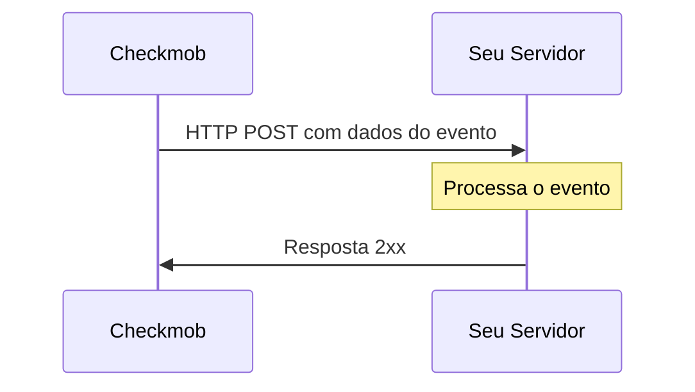

# Introdução aos Webhooks da Checkmob

## Visão Geral

Os webhooks da Checkmob fornecem uma maneira poderosa de receber notificações em tempo real sobre eventos que ocorrem em sua conta Checkmob. Isso permite que você construa integrações que respondam imediatamente às mudanças em seus dados da Checkmob.

## Como os Webhooks Funcionam

1. **Evento Ocorre**: Quando um evento específico acontece na Checkmob (ex: um novo lead é criado)
2. **Notificação Enviada**: A Checkmob envia uma requisição HTTP POST para sua URL de webhook
3. **Seu Sistema Processa**: Seu servidor recebe os dados e pode tomar a ação apropriada
4. **Resposta Necessária**: Seu servidor deve responder com um código de status 2xx dentro de 5 segundos

## Fluxo do Webhook

## Benefícios

- **Atualizações em Tempo Real**: Receba notificações instantâneas sobre eventos importantes
- **Eficiente**: Não há necessidade de consultar constantemente os servidores da Checkmob
- **Confiável**: Mecanismo automático de nova tentativa para entregas com falha
- **Flexível**: Processe eventos de acordo com suas necessidades de negócio

## Casos de Uso Comuns

- Automação de gerenciamento de leads
- Sincronização com CRM
- Análises personalizadas
- Sistemas de notificação
- Backup de dados
- Integração com outros serviços

## Próximos Passos

- Aprenda como [configurar seu webhook](configuration.md)
- Explore os [eventos disponíveis](events.md)
- Revise as [melhores práticas de segurança](security.md)
- Confira os [exemplos de implementação](examples.md) 